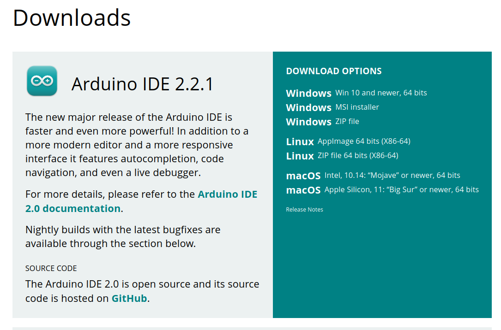

# Downloading And Installing The Arduino IDE

The [Arduino IDE](https://www.arduino.cc/en/software) is used to compile and upload 
a server sketch to the ESP32 device. Click on the link in the previous sentence and 
download and install
the latest version for your computer platform.

View the **Install the Arduino Desktop** section of 
[Getting Started with Arduino products](https://www.arduino.cc/en/Guide) for detailed
installation instructions.
