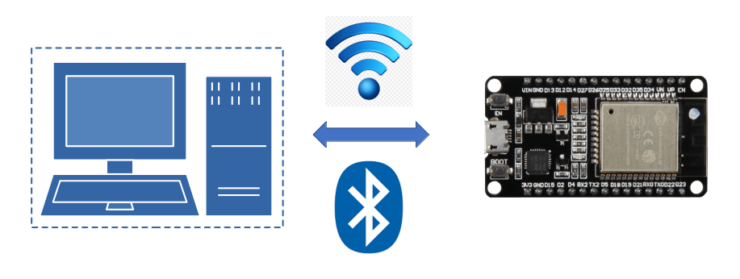

<i>Remotely Monitor And Control An ESP32 With</i>

<i>Telemetrix-ESP32</i>

 
# 

The **_telemetrix-esp32_** project allows you to 
access ESP32 devices over WI-FI or BLE using Python scripts.

The project consists of client APIs used to create Python applications. It also 
consists of ESP32 resident servers uploaded to an 
ESP32 
device.

For WI-FI and BLE, there are two APIs, one implemented using threading and the other 
using asyncio. 

**NOTE: The threaded BLE API is incompatible with Windows or Raspberry Pi OS. 
However, the asyncio API is compatible with both.**

## Features
All three APIs share a common set of features:

* Analog Input
* Analog (PWM) Output
* Analog (DAC) Output
* Digital Input
* Digital Input with Pull Up
* Digital Input with Pull Down
* Digital Output
* Touch Pin Input
* I2C Communications Protocol Primitives
* SPI Communications Protocol Primitives
* OneWire Communications Protocol Primitives
* Support For HC-SR04 Type Distance Sensors
* Support For DHT Temperature/Humidity Sensors
* Servo Motors
* Stepper Motors
* All Data change events are reported asynchronously via user registered callback 
  functions and are timestamped. 
* Integrated server debugging facilities is included. 

## API Documentation
Online API documentation is available for the
[WI-FI And BLE Threaded Model](https://htmlpreview.github.io/?https://github.
com/MrYsLab/telemetrix-esp32/blob/master/html/telemetrix_esp32/index.html)
API and a separate API for the [WI-FI And BLE Asyncio Model](https://htmlpreview.github.io?https://github.com/MrYsLab/telemetrix-esp32/blob/master/html/telemetrix_aio_esp32/index.html).

## Examples
An extensive set of examples is provided for each of the APIs. Links to all the 
examples are in the table below. You may need to use the horizontal scroll bar at the 
bottom of the table to see the examples' links.

| Feature                           | Feature Type              | WI-FI Examples                                                                                                                               | WI-FI Asyncio Examples                                                                                                                                   | BLE Examples                                                                                                                              | BLE Asyncio Examples                                                                                                                                  |
|-----------------------------------|---------------------------|----------------------------------------------------------------------------------------------------------------------------------------------|----------------------------------------------------------------------------------------------------------------------------------------------------------|-------------------------------------------------------------------------------------------------------------------------------------------|-------------------------------------------------------------------------------------------------------------------------------------------------------|
| Analog Input                      | GPIO                      | [analog_input_wifi.py](https://github.com/MrYsLab/telemetrix-esp32/blob/master/examples/wifi/analog_input_wifi.py)                           | [analog_input_wifi_aio.py](https://github.com/MrYsLab/telemetrix-esp32/blob/master/examples/wifi-aio/analog_input_wifi_aio.py)                           | [analog_input_ble.py](https://github.com/MrYsLab/telemetrix-esp32/blob/master/examples/ble/analog_input_ble.py)                           | [analog_input_ble_aio.py](https://github.com/MrYsLab/telemetrix-esp32/blob/master/examples/ble-aio/analog_input_ble_aio.py)                           |
| Analog Output (PWM)               | GPIO                      | [fade_wifi.py](https://github.com/MrYsLab/telemetrix-esp32/blob/master/examples/wifi/fade_wifi.py)                                           | [fade_wifi_aio.py](https://github.com/MrYsLab/telemetrix-esp32/blob/master/examples/wifi-aio/fade_wifi_aio.py)                                           | [fade_ble.py](https://github.com/MrYsLab/telemetrix-esp32/blob/master/examples/ble/fade_ble.py)                                           | [fade_ble_aio.py](https://github.com/MrYsLab/telemetrix-esp32/blob/master/examples/ble-aio/fade_ble_aio.py)                                           |
| Analog Output (DAC)               | GPIO                      | [dac_wifi.py](https://github.com/MrYsLab/telemetrix-esp32/blob/master/examples/wifi/dac_wifi.py)                                             | [dac_wifi_aio.py](https://github.com/MrYsLab/telemetrix-esp32/blob/master/examples/wifi-aio/dac_wifi_aio.py)                                             | [dac_ble.py](https://github.com/MrYsLab/telemetrix-esp32/blob/master/examples/ble/dac_ble.py)                                             | [dac_ble_aio.py](https://github.com/MrYsLab/telemetrix-esp32/blob/master/examples/ble-aio/dac_ble_aio.py)                                             |
| Digital Input                     | GPIO                      | [digital_input_wifi.py](https://github.com/MrYsLab/telemetrix-esp32/blob/master/examples/wifi/digital_input_wifi.py)                         | [digital_input_wifi_aio.py](https://github.com/MrYsLab/telemetrix-esp32/blob/master/examples/wifi-aio/digital_input_wifi_aio.py)                         | [digital_input_ble.py](https://github.com/MrYsLab/telemetrix-esp32/blob/master/examples/ble/digital_input_ble.py)                         | [digital_input_ble_aio.py](https://github.com/MrYsLab/telemetrix-esp32/blob/master/examples/ble-aio/digital_input_ble_aio.py)                         |
| Digital Input Pull Down           | GPIO                      | [digital_input_pulldown_wifi.py](https://github.com/MrYsLab/telemetrix-esp32/blob/master/examples/wifi/digital_input_pulldown_wifi.py)       | [digital_input_pulldown_wifi_aio.py](https://github.com/MrYsLab/telemetrix-esp32/blob/master/examples/wifi-aio/digital_input_pulldown_wifi_aio.py)       | [digital_input_pulldown_ble.py](https://github.com/MrYsLab/telemetrix-esp32/blob/master/examples/ble/digital_input_pulldown_ble.py)       | [digital_input_pulldown_ble_aio.py](https://github.com/MrYsLab/telemetrix-esp32/blob/master/examples/ble-aio/digital_input_pulldown_ble_aio.py)       |
| Digital Input Pull Up             | GPIO                      | [digital_input_pullup_wifi.py](https://github.com/MrYsLab/telemetrix-esp32/blob/master/examples/wifi/digital_input_pullup_wifi.py)           | [digital_input_pullup_wifi_aio.py](https://github.com/MrYsLab/telemetrix-esp32/blob/master/examples/wifi-aio/digital_input_pullup_wifi_aio.py)           | [digital_input_pullup_ble.py](https://github.com/MrYsLab/telemetrix-esp32/blob/master/examples/ble/digital_input_pullup_ble.py)           | [digital_input_pullup_ble_aio.py](https://github.com/MrYsLab/telemetrix-esp32/blob/master/examples/ble-aio/digital_input_pullup_ble_aio.py)           |
| Digital Output                    | GPIO                      | [blink_wifi.py](https://github.com/MrYsLab/telemetrix-esp32/blob/master/examples/wifi/blink_wifi.py)                                         | [blink_wifi_aio.py](https://github.com/MrYsLab/telemetrix-esp32/blob/master/examples/wifi-aio/blink_wifi_aio.py)                                         | [blink_ble.py](https://github.com/MrYsLab/telemetrix-esp32/blob/master/examples/ble/blink_ble.py)                                         | [blink_ble_aio.py](https://github.com/MrYsLab/telemetrix-esp32/blob/master/examples/ble-aio/blink_ble_aio.py)                                         |
| Touch Pin Input                   | GPIO                      | [touch_wifi.py](https://github.com/MrYsLab/telemetrix-esp32/blob/master/examples/wifi/touch_input_wifi.py)                                   | [touch_wifi_aio.py](https://github.com/MrYsLab/telemetrix-esp32/blob/master/examples/wifi-aio/touch_input_wifi_aio.py)                                   | [touch_ble.py](https://github.com/MrYsLab/telemetrix-esp32/blob/master/examples/ble/touch_input_ble.py)                                   | [touch_ble_aio.py](https://github.com/MrYsLab/telemetrix-esp32/blob/master/examples/ble-aio/touch_input_ble_aio.py)                                   |
| i2c (ADXL345 Accelerometer)       | Device Communications Bus | [i2c_adxl345_accelerometer_wifi.py](https://github.com/MrYsLab/telemetrix-esp32/blob/master/examples/wifi/i2c_adxl345_accelerometer_wifi.py) | [i2c_adxl345_accelerometer_wifi_aio.py](https://github.com/MrYsLab/telemetrix-esp32/blob/master/examples/wifi-aio/i2c_adxl345_accelerometer_wifi_aio.py) | [i2c_adxl345_accelerometer_ble.py](https://github.com/MrYsLab/telemetrix-esp32/blob/master/examples/ble/i2c_adxl345_accelerometer_ble.py) | [i2c_adxl345_accelerometer_ble_aio.py](https://github.com/MrYsLab/telemetrix-esp32/blob/master/examples/ble-aio/i2c_adxl345_accelerometer_ble_aio.py) |
| OneWire (DS18x20 Thermometer)     | Device Communications Bus | [onewire_ds18x20_wifi.py](https://github.com/MrYsLab/telemetrix-esp32/blob/master/examples/wifi/onewire_ds18x20_wifi.py)                     | [onewire_ds18x20_wifi_aio.py](https://github.com/MrYsLab/telemetrix-esp32/blob/master/examples/wifi-aio/onewire_ds18x20_wifi_aio.py)                     | [onewire_ds18x20_ble.py](https://github.com/MrYsLab/telemetrix-esp32/blob/master/examples/ble/onewire_ds18x20_ble.py)                     | [onewire_ds18x20_ble_aio.py](https://github.com/MrYsLab/telemetrix-esp32/blob/master/examples/ble-aio/onewire_ds18x20_ble_aio.py)                     |
| SPI (MPU9250 Accelerometer)       | Device Communications Bus | [spi_mpu9250_wifi.py](https://github.com/MrYsLab/telemetrix-esp32/blob/master/examples/wifi/spi_mpu9250_wifi.py)                             | [spi_mpu9250_wifi_aio.py](https://github.com/MrYsLab/telemetrix-esp32/blob/master/examples/wifi-aio/spi_mpu9250_wifi_aio.py)                             | [spi_mpu9250_ble.py](https://github.com/MrYsLab/telemetrix-esp32/blob/master/examples/ble/spi_mpu9250_ble.py)                             | [spi_mpu9250_ble_aio.py](https://github.com/MrYsLab/telemetrix-esp32/blob/master/examples/ble-aio/spi_mpu9250_ble_aio.py)                             |
| DHT Temperature/Humidity Sensor   | Sensor Device Support     | [dht_wifi.py](https://github.com/MrYsLab/telemetrix-esp32/blob/master/examples/wifi/dht_wifi.py)                                             | [dht_wifi_aio.py](https://github.com/MrYsLab/telemetrix-esp32/blob/master/examples/wifi-aio/dht_wifi_aio.py)                                             | [dht_ble.py](https://github.com/MrYsLab/telemetrix-esp32/blob/master/examples/ble/dht_ble.py)                                             | [dht_ble_aio.py](https://github.com/MrYsLab/telemetrix-esp32/blob/master/examples/ble-aio/dht_ble_aio.py)                                             |
| HC-SR04 Sonar Distance Sensor     | Sensor Device Support     | [hc-sr04_distance_sensor_wifi.py](https://github.com/MrYsLab/telemetrix-esp32/blob/master/examples/wifi/hc-sr04_distance_sensor_wifi.py)     | [hc-sr04_distance_sensor_wifi_aio.py](https://github.com/MrYsLab/telemetrix-esp32/blob/master/examples/wifi-aio/hc-sr04_distance_sensor_wifi_aio.py)     | [hc-sr04_distance_sensor_ble.py](https://github.com/MrYsLab/telemetrix-esp32/blob/master/examples/ble/hc-sr04_distance_sensor_ble.py)     | [hc-sr04_distance_sensor_ble_aio.py](https://github.com/MrYsLab/telemetrix-esp32/blob/master/examples/ble-aio/hc-sr04_distance_sensor_ble_aio.py)     |
| Servo Motor                       | Motor Control             | [servo_wifi.py](https://github.com/MrYsLab/telemetrix-esp32/blob/master/examples/wifi/servo_wifi.py)                                         | [servo_wifi_aio.py](https://github.com/MrYsLab/telemetrix-esp32/blob/master/examples/wifi-aio/servo_wifi_aio.py)                                         | [servo_ble.py](https://github.com/MrYsLab/telemetrix-esp32/blob/master/examples/ble/servo_ble.py)                                         | [servo_ble_aio.py](https://github.com/MrYsLab/telemetrix-esp32/blob/master/examples/ble-aio/servo_ble_aio.py)                                         |
| Stepper Motor (Absolute Position) | Motor Control             | [stepper_absolute_wifi.py](https://github.com/MrYsLab/telemetrix-esp32/blob/master/examples/wifi/stepper_absolute_wifi.py)                   | [stepper_absolute_wifi_aio.py](https://github.com/MrYsLab/telemetrix-esp32/blob/master/examples/wifi-aio/stepper_absolute_wifi_aio.py)                   | [stepper_absolute_ble.py](https://github.com/MrYsLab/telemetrix-esp32/blob/master/examples/ble/stepper_absolute_ble.py)                   | [stepper_absolute_ble_aio.py](https://github.com/MrYsLab/telemetrix-esp32/blob/master/examples/ble-aio/stepper_absolute_ble_aio.py)                   |
| Stepper Motor (Continuous Motion) | Motor Control             | [stepper_continuous_wifi.py](https://github.com/MrYsLab/telemetrix-esp32/blob/master/examples/wifi/stepper_continuous_wifi.py)               | [stepper_continuous_wifi_aio.py](https://github.com/MrYsLab/telemetrix-esp32/blob/master/examples/wifi-aio/stepper_continuous_wifi_aio.py)               | [stepper_continuous_ble.py](https://github.com/MrYsLab/telemetrix-esp32/blob/master/examples/ble/stepper_continuous_ble.py)               | [stepper_continuous_ble_aio.py](https://github.com/MrYsLab/telemetrix-esp32/blob/master/examples/ble-aio/stepper_continuous_ble_aio.py)               |
| Stepper Motor (Relative Position) | Motor Control             | [stepper_relative_wifi.py](https://github.com/MrYsLab/telemetrix-esp32/blob/master/examples/wifi/stepper_relative_wifi.py)                   | [stepper_relative_wifi_aio.py](https://github.com/MrYsLab/telemetrix-esp32/blob/master/examples/wifi-aio/stepper_relative_wifi_aio.py)                   | [stepper_relative_ble.py](https://github.com/MrYsLab/telemetrix-esp32/blob/master/examples/ble/stepper_relative_ble.py)                   | [stepper_relative_ble_aio.py](https://github.com/MrYsLab/telemetrix-esp32/blob/master/examples/ble-aio/stepper_relative_ble_aio.py)                   |
| Transport Loopback Diagnostic     | System Diagnostic         | [loop_back_wifi.py](https://github.com/MrYsLab/telemetrix-esp32/blob/master/examples/wifi/loop_back_wifi.py)                                 | [loop_back_wifi_aio.py](https://github.com/MrYsLab/telemetrix-esp32/blob/master/examples/wifi-aio/loop_back_wifi_aio.py)                                 | [loop_back_ble.py](https://github.com/MrYsLab/telemetrix-esp32/blob/master/examples/ble/loop_back_ble.py)                                 | [loop_back_ble_aio.py](https://github.com/MrYsLab/telemetrix-esp32/blob/master/examples/ble-aio/loop_back_ble_aio.py)                                 |

 
 

Copyright (C) 2022 Alan Yorinks. All Rights Reserved.

**Last updated 11 April 2022 **

