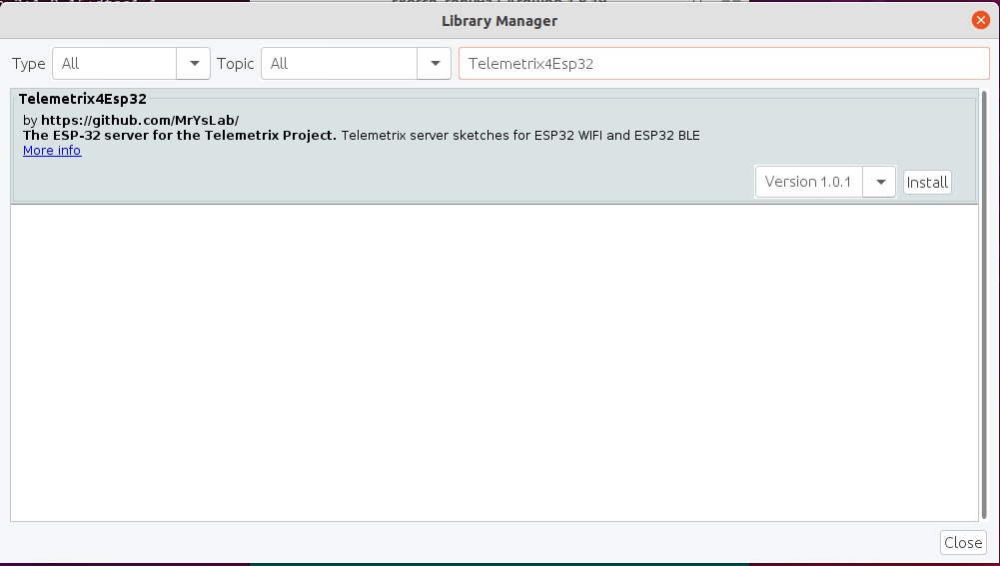
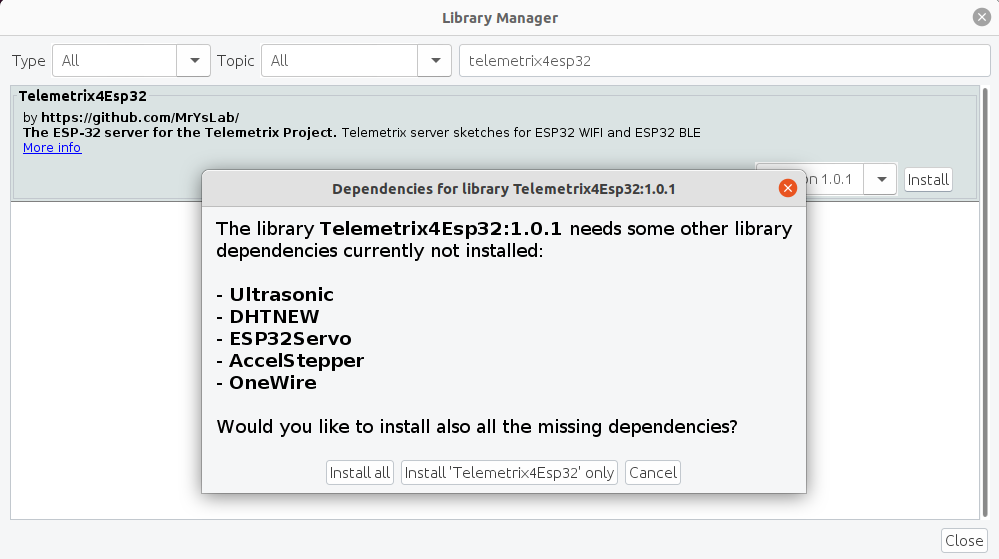
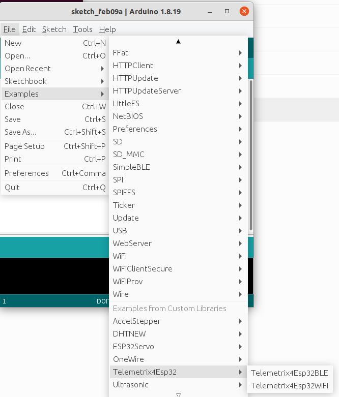
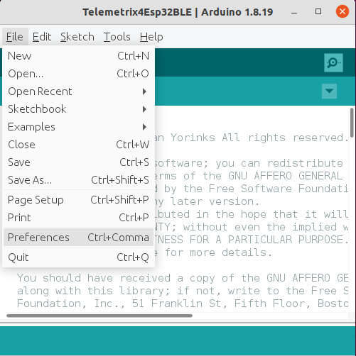
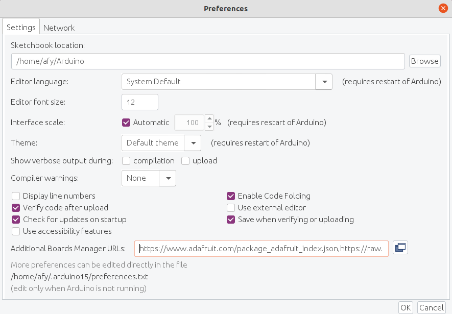
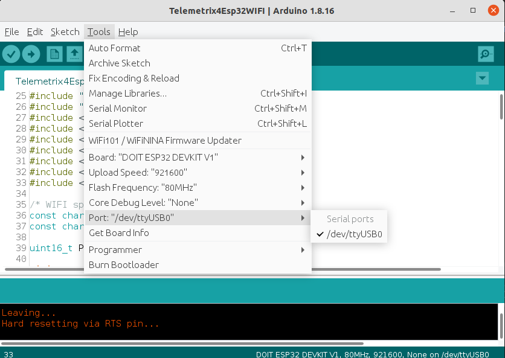
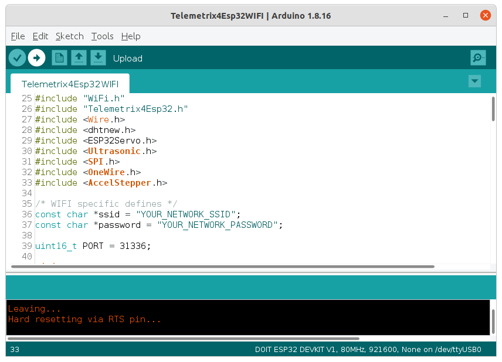
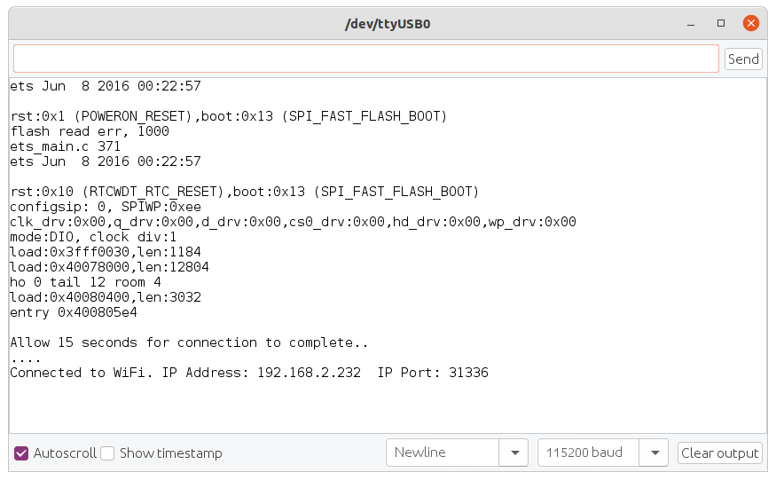
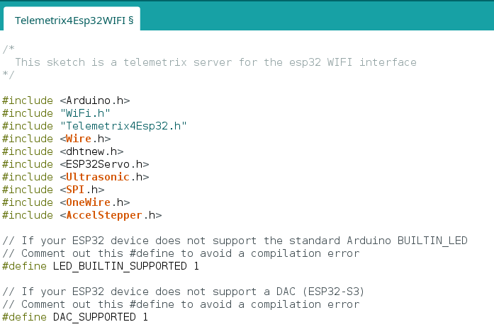

# Installing the WI-FI and BLE ESP32 Servers


## Add The [Telemetrix4Esp32 Library](https://github.com/MrYsLab/Telemetrix4Esp32) To The Arduino IDE 

Open the Arduino IDE and select Tools/Manage Libraries.


Enter "Telemetrix4Esp32 in the search box.



Click on the **_Install_** button. You will be prompted to allow the installation
of additional libraries. Accept the installation for all.




Both the WI-FI and BLE servers are installed into the Arduino IDE from this single
library, and you can select either server from the File/Examples menu.




## Add The Arduino Core For ESP32 To The Arduino IDE

The Arduino core for the ESP32 needs to be installed into the IDE to compile the server sketches.

To do so, select **_File_** in the main menu of the Arduino IDE and then select 
**_Preferences_**.



Copy the following line into the **_Additional Boards Manager URLs_** edit box:

```angular2html
https://raw.githubusercontent.com/espressif/arduino-esp32/gh-pages/package_esp32_index.json

```


Click the Ok button.

## Select Either The WI-FI Or BLE Server Sketch For Compilation


### WI-FI Sketch Preparation Prior To Compilation

Your router assigns the ESP32 device an IP address. To determine the device's IP 
address, you must first modify the sketch to indicate your network name (SSID) and
the password before compiling. Look for "YOUR_NETWORK_SSID" and replace that with the 
name of your 
network. Be sure to retain the quotation marks. On the following line, replace 
"YOUR_NETWORK_PASSWORD" with your network password, again including the quotation marks.


### Uploading The Sketch

Now, connect your ESP32 device to your computer and select the port for uploading 
using the Tools/Port IDE selection.



Next, click on the Upload button at the top of 
the Arduino IDE to compile and upload the sketch to ESP32.




When loading is complete, click on the Serial Monitor button in the upper right corner
of the IDE. Set the speed to 115200, then press the reset button or re-power the ESP32.

The IP address assigned to the ESP32 is displayed.



If your ESP32 device has a Board LED, it will remain lit until the 
connection succeeds and then extinguishes.

Note the IP address since you must include it when using one of the Python WI-FI APIs.

### BLE Sketch Preparation Prior To Compilation

No modifications to the sketch are necessary for BLE. Follow the 
**_Uploading The Sketch_**
section above to install the sketch.

The Board LED behaves differently for BLE. It will remain lit until the Python application
successfully connects to the ESP 32 device. 

### Additional Sketch Preparation

For boards that do not have a user-programmable board resident LED, comment out
the following #define.
```angular2html
// If your ESP32 device does not support the standard Arduino BUILTIN_LED
// Comment out this #define to avoid a compilation error
#define LED_BUILTIN 1
```

For ESP-32 S3 boards, comment out the following #define.
```angular2html
// If your ESP32 device does not support a DAC (ESP32-S3)
// Comment out this #define to avoid a compilation error
#define DAC_SUPPORTED 1
```

